# AWS Infrastructure Architecture Diagram

```mermaid
graph TB
    %% Internet and External Access
    Internet[🌐 Internet<br/>0.0.0.0/0]
    
    %% VPC Container
    subgraph VPC["🏢 VPC (10.0.0.0/16)"]
        %% Internet Gateway
        IGW[🚪 Internet Gateway<br/>main-igw]
        
        %% Availability Zones
        subgraph AZ1["📍 Availability Zone 1"]
            %% Public Subnet
            subgraph PubSub["🌐 Public Subnet<br/>10.0.1.0/24"]
                WebServer[💻 EC2 Web Server<br/>t3.micro<br/>Apache HTTP]
                NAT[🔄 NAT Gateway<br/>+ Elastic IP]
            end
        end
        
        subgraph AZ2["📍 Availability Zone 2"]
            %% Private Subnet 1
            subgraph PrivSub1["🔒 Private Subnet<br/>10.0.2.0/24"]
                PrivateRes1[📦 Private Resources]
            end
        end
        
        subgraph AZ3["📍 Availability Zone 3"]
            %% Private Subnet 2 (DB)
            subgraph PrivSub2["🔒 Private DB Subnet<br/>10.0.3.0/24"]
                RDS[(🗄️ RDS PostgreSQL<br/>db.t3.micro<br/>maindb)]
            end
        end
        
        %% Route Tables
        PubRT[📋 Public Route Table<br/>→ 0.0.0.0/0 via IGW]
        PrivRT[📋 Private Route Table<br/>→ 0.0.0.0/0 via NAT]
        
        %% Security Groups
        subgraph SG["🛡️ Security Groups"]
            WebSG[🌐 Web Security Group<br/>Inbound: 80,443 from 0.0.0.0/0<br/>Outbound: All traffic]
            DBSG[🔒 Database Security Group<br/>Inbound: 5432,3306 from Web SG<br/>Outbound: All traffic]
        end
        
        %% DB Subnet Group
        DBSubnetGroup[📊 DB Subnet Group<br/>Private Subnets]
    end
    
    %% Connections
    Internet --> IGW
    IGW --> PubSub
    PubSub --> PubRT
    PrivSub1 --> PrivRT
    PrivSub2 --> PrivRT
    NAT --> IGW
    PrivRT --> NAT
    
    %% Security Group Associations
    WebServer -.-> WebSG
    RDS -.-> DBSG
    
    %% DB Subnet Group Association
    DBSubnetGroup -.-> PrivSub1
    DBSubnetGroup -.-> PrivSub2
    RDS -.-> DBSubnetGroup
    
    %% Traffic Flow
    WebServer -->|Port 5432| RDS
    WebSG -->|Allows DB Access| DBSG
    
    %% Styling
    classDef vpc fill:#e1f5fe,stroke:#01579b,stroke-width:3px
    classDef public fill:#e8f5e8,stroke:#2e7d32,stroke-width:2px
    classDef private fill:#fff3e0,stroke:#ef6c00,stroke-width:2px
    classDef security fill:#fce4ec,stroke:#c2185b,stroke-width:2px
    classDef database fill:#f3e5f5,stroke:#7b1fa2,stroke-width:2px
    
    class VPC vpc
    class PubSub,WebServer,NAT,PubRT public
    class PrivSub1,PrivSub2,PrivRT,PrivateRes1 private
    class WebSG,DBSG,SG security
    class RDS,DBSubnetGroup database
```

## Architecture Overview

### 🏗️ **Infrastructure Components**

**VPC (Virtual Private Cloud)**
- CIDR: 10.0.0.0/16
- DNS hostnames and support enabled
- Spans multiple Availability Zones

**Subnets**
- **Public Subnet** (10.0.1.0/24): Web server with internet access
- **Private Subnet 1** (10.0.2.0/24): General private resources
- **Private Subnet 2** (10.0.3.0/24): Database subnet

**Compute Resources**
- **EC2 Web Server**: t3.micro instance running Apache HTTP server
- **RDS PostgreSQL**: db.t3.micro database instance

### 🔒 **Security Architecture**

**Web Security Group**
- Inbound: HTTP (80) and HTTPS (443) from anywhere
- Outbound: All traffic allowed

**Database Security Group**
- Inbound: PostgreSQL (5432) and MySQL (3306) only from Web Security Group
- Outbound: All traffic allowed

### 🌐 **Network Flow**

1. **Internet Traffic** → Internet Gateway → Public Subnet → Web Server
2. **Web Server** → Database Security Group → RDS PostgreSQL
3. **Private Resources** → NAT Gateway → Internet Gateway → Internet (outbound only)

### 🛡️ **Security Features**

- Database isolated in private subnets (no direct internet access)
- Security group rules restrict database access to web tier only
- NAT Gateway provides secure outbound internet access for private resources
- RDS storage encryption enabled
- Sensitive database password stored in variables

This architecture follows AWS best practices for a secure, scalable web application with proper network segmentation and security controls.

